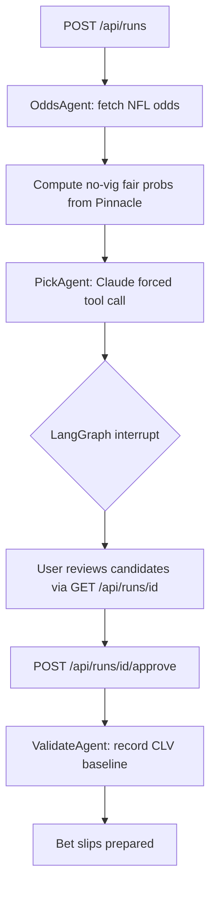

# SteamBot

[](https://github.com/coreystevensdev/steambot/actions)
[](https://github.com/coreystevensdev/steambot/actions)
[](eval/dataset.jsonl)

Agentic NFL betting research service that finds closing line value before the market closes. Pulls Pinnacle sharp-book lines via The Odds API, strips vig to no-vig fair probabilities, then uses Claude to surface picks where retail prices measurably beat the sharp-market consensus. LangGraph HITL checkpoint requires user approval before any bet slip is prepared.

## Problem

Retail sports bettors lose because they bet off public lines that already carry bookmaker margin. Closing Line Value (CLV) is the market-validated signal that separates long-run winners from losers: if you consistently beat the closing line, you have genuine edge. No public tool automates this research pipeline end-to-end with HITL approval built in.

## Solution

The pipeline runs as a LangGraph StateGraph: fetch Pinnacle odds, strip vig to no-vig fair probabilities for each side, filter picks by a minimum edge threshold, then call Claude with a forced `submit_picks` tool to generate structured pick candidates. An `interrupt()` checkpoint pauses the graph for user approval before any bet slip is finalized. State persists via `PostgresSaver` so approval sessions survive server restarts. CLV is recorded post-settlement for every approved pick, building a backtestable track record.

---

## How it works



**Data source routing:**

| Source | Purpose | Access |
|---|---|---|
| Pinnacle (via The Odds API) | Sharp-line reference; no-vig fair probability | `ODDS_API_KEY` |
| FanDuel / DraftKings / BetMGM | Retail price comparison; line shopping | Same key |
| Anthropic Claude | Pick generation with forced `submit_picks` tool call | `ANTHROPIC_API_KEY` |
| Stripe | Subscription billing (Pro tier) | `STRIPE_SECRET_KEY` |

---

## Tech stack

| Layer | Technology | Why |
|---|---|---|
| Agent orchestration | LangGraph 0.3+ | Stateful graph with first-class `interrupt()` for HITL; `PostgresSaver` for durable checkpoints across restarts |
| LLM | Anthropic Claude (forced tool call) | Forced tool use (`submit_picks`) guarantees structured output; no output parsing |
| Odds data | The Odds API v4 | Single endpoint returns Pinnacle + 40 retail books in one call; 500 free req/month is enough for a daily picks run |
| Sharp-line math | `american_to_prob` + `remove_vig` | Converting American odds to implied probability then normalizing removes the bookmaker overround in O(n) |
| API | FastAPI | Async lifespan manages shared httpx client and graph instance |
| Database | PostgreSQL + SQLAlchemy | Pick history and CLV tracking; `PostgresSaver` for LangGraph checkpoints |
| Payments | Stripe webhooks | Subscription lifecycle via `customer.subscription.created/deleted` events |
| Testing | pytest + respx | respx mocks at the httpx transport layer; no network calls in CI |
| Observability | LangSmith | Traces each graph run at node level; HITL pause and resume appear as two linked traces (`picks/...` then `approve/...`), making the two-phase architecture visible without reading code |

---

## Closing Line Value (CLV)

CLV is the difference between the price you got and the closing line probability:

```
CLV = closing_probability - bet_probability
```

A positive CLV means you beat the market. Sportsbooks use CLV to identify sharp bettors and limit their accounts. SteamBot records `closing_price` and `closing_probability` post-settlement for every approved pick, so you can run `SELECT AVG(clv) FROM picks WHERE result IS NOT NULL` and see whether you're consistently ahead of the market.

---

## Getting started

```bash
cp .env.example .env
# fill in ANTHROPIC_API_KEY, ODDS_API_KEY, STRIPE_SECRET_KEY, STRIPE_WEBHOOK_SECRET
docker compose up
```

API is available at `http://localhost:8000`. The `/health` endpoint confirms the service is running.

**Start a picks run:**

```bash
curl -s -X POST http://localhost:8000/api/runs \
  -H "Content-Type: application/json" \
  -d '{"sport": "americanfootball_nfl", "user_id": "demo"}' | jq
```

**Approve candidates:**

```bash
curl -s -X POST http://localhost:8000/api/runs/{run_id}/approve \
  -H "Content-Type: application/json" \
  -d '{"approved_pick_ids": ["pick-uuid-1", "pick-uuid-2"], "user_id": "demo"}' | jq
```

### Tracing

Add your LangSmith key to `.env` to enable run tracing:

```bash
LANGCHAIN_API_KEY=lsv2_pt_...
LANGCHAIN_TRACING_V2=true
LANGCHAIN_PROJECT=steambot
```

Each picks run produces two traces in the LangSmith UI:

- `picks/americanfootball_nfl/2026-01-15` -- covers odds fetch, fair-line derivation, Claude pick generation, and the HITL pause
- `approve/<run_id>` -- covers the resume and pick persistence

Tracing is optional. The service starts and runs normally without `LANGCHAIN_API_KEY` set.

**Run tests (no API keys needed):**

```bash
pip install -e ".[dev]"
pytest -q
```

---

## Eval harness

`eval/dataset.jsonl` contains 18 golden test cases that verify the deterministic math layer independently of the LLM. Run without API keys:

```bash
pip install -e ".[dev]"
python -m eval
```

Output:
```
vig_removal          5/5  [#####]
ev_calculation       4/4  [####]
clv_calculation      3/3  [###]
edge_filter          3/3  [###]
structural           3/3  [###]

Total: 18/18 passed  pass rate: 100.0%
```

To write a JSON report:

```bash
python -m eval --out eval/report.json
```

**What is tested:** vig removal accuracy (symmetric and asymmetric markets), EV formula correctness for favorites and underdogs, CLV sign convention (positive = beat the closing line), edge filter threshold compliance, and pick structural validity (required fields, confidence enum, non-negative edge). The harness imports directly from `steambot.state` so any change to the production math functions fails the eval immediately.

---

## Known limitations

1. **Rate limiting is per-instance.** There is no shared Redis counter across multiple app replicas. Fine for the current demo scale; documented trade-off.
2. **Off-season returns empty.** The Odds API returns no NFL games May through July. The `/api/runs` endpoint returns an empty `candidates` list rather than an error, which is correct but may confuse first-time callers.
3. **Closing line not auto-fetched.** CLV requires a second Odds API call at market close. The `closing_price` and `closing_probability` fields on `Pick` are set to `null` until a settlement job populates them. Settlement automation is not included.
4. **No authentication.** The `user_id` field is caller-supplied with no JWT verification. Adding auth is the first production-readiness gap.
5. **MemorySaver in tests.** The graph uses `MemorySaver` (in-process) for local dev. Production requires `PostgresSaver` for checkpoints to survive restarts; the switchover is a one-line change in `graph.py`.
