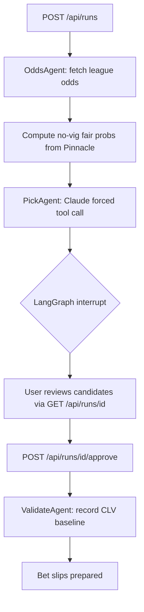

# Fairline

[](https://github.com/coreystevensdev/fairline/actions)
[](https://github.com/coreystevensdev/fairline/actions)
[](eval/dataset.jsonl)

Agentic betting research service for NFL, NBA, MLB, and NHL that finds closing line value before the market closes. Pulls Pinnacle sharp-book lines via The Odds API, strips vig to no-vig fair probabilities, then uses Claude to surface picks where retail prices measurably beat the sharp-market consensus. LangGraph HITL checkpoint requires user approval before any bet slip is prepared. Every pick carries its producing agent as a byline, and each agent's record is graded by CLV, a harder standard than win rate.

## Problem

Retail sports bettors lose because they bet off public lines that already carry bookmaker margin. Closing Line Value (CLV) is the market-validated signal that separates long-run winners from losers: if you consistently beat the closing line, you have genuine edge. No public tool automates this research pipeline end-to-end with HITL approval built in.

## Solution

The pipeline runs as a LangGraph StateGraph: fetch Pinnacle odds, strip vig to no-vig fair probabilities for each side, filter picks by a minimum edge threshold, then call Claude with a forced `submit_picks` tool to generate structured pick candidates. An `interrupt()` checkpoint pauses the graph for user approval before any bet slip is finalized. State persists via `PostgresSaver` so approval sessions survive server restarts. CLV is recorded post-settlement for every approved pick, building a backtestable track record.

---

## How it works



**Data source routing:**

| Source | Purpose | Access |
|---|---|---|
| Pinnacle (via The Odds API) | Sharp-line reference; no-vig fair probability | `ODDS_API_KEY` |
| FanDuel / DraftKings / BetMGM | Retail price comparison; line shopping | Same key |
| Anthropic Claude | Pick generation with forced `submit_picks` tool call | `ANTHROPIC_API_KEY` |
| Stripe | Subscription billing (Pro tier) | `STRIPE_SECRET_KEY` |

---

## Tech stack

| Layer | Technology | Why |
|---|---|---|
| Agent orchestration | LangGraph 0.3+ | Stateful graph with first-class `interrupt()` for HITL; `PostgresSaver` for durable checkpoints across restarts |
| LLM | Anthropic Claude (forced tool call) | Forced tool use (`submit_picks`) guarantees structured output; no output parsing |
| Odds data | The Odds API v4 | Single endpoint returns Pinnacle + 40 retail books in one call; 500 free req/month is enough for a daily picks run |
| Sharp-line math | `american_to_prob` + `remove_vig` | Converting American odds to implied probability then normalizing removes the bookmaker overround in O(n) |
| API | FastAPI | Async lifespan manages shared httpx client and graph instance |
| Auth | Bearer API keys, SHA-256 at rest | Identity derives from the key server-side, so ownership checks compare against a real principal instead of a caller-supplied user_id; no external auth dependency |
| Database | PostgreSQL + SQLAlchemy | Pick history and CLV tracking; `PostgresSaver` for LangGraph checkpoints |
| Payments | Stripe webhooks | Subscription lifecycle via `customer.subscription.created/deleted` events |
| Testing | pytest + respx | respx mocks at the httpx transport layer; no network calls in CI |
| Observability | LangSmith | Traces each graph run at node level; HITL pause and resume appear as two linked traces (`picks/...` then `approve/...`), making the two-phase architecture visible without reading code |

---

## Closing Line Value (CLV)

CLV compares the price you took against the sharp book's closing price:

```
CLV = no-vig closing probability - implied probability of the price you bet
```

A positive CLV means you beat the close. Sportsbooks use CLV to identify sharp bettors and limit their accounts. The comparison is against the price actually taken, not the model's estimate: if Pinnacle closes at a no-vig 52.2% and you bet at -108 (implied 51.9%), you have +0.3% CLV whatever the model believed.

The settlement job captures closing lines:

```bash
python -m fairline settle --window-minutes 30 --sport all
```

It finds picks with no `closing_price` whose game starts within the window, pulls the current Pinnacle market, devigs it, and writes `closing_price`, `closing_probability`, and `clv`. Run it near kickoff (cron a few minutes before the day's first game).

After games finish, grade results:

```bash
python -m fairline grade --sport all
```

Grading pulls final scores (up to 3 days back, the API maximum), settles each pick against the number it was bet at, and writes `result` (win/loss/push) and `profit_units` for a 1-unit flat stake. Spreads grade against the margin plus the taken point, totals against the combined score, and exact landings push. The full performance query:

```sql
SELECT COUNT(*), AVG(clv), SUM(profit_units) FROM picks WHERE result IS NOT NULL;
```

Positive average CLV with a losing `profit_units` over a small sample means variance; negative CLV with a winning record means luck that will not hold.

### Trends

ATS and over/under records come from Fairline's own data, no stats provider: the watcher's last pre-kickoff snapshot is each game's closing line, and grading already fetches final scores. `fairline grade` joins the two into `game_results`, and a `trends_agent` node attaches each team's recent records to the pick prompt, so the pick agent cites real form instead of guessing at it.

```bash
python -m fairline trends --team "Kansas City Chiefs" --last 10
```

```
Kansas City Chiefs: 7-3-0 SU, 6-3-1 ATS, 4-5-1 O/U (last 10)
```

Also served at `GET /api/trends?team=...&last_n=10`. Coverage grows with collection: games the watcher never saw count toward straight-up records only, since their closing lines were never captured.

### Agent records

Every pick is stamped with the agent that produced it (`source`), and the leaderboard grades each agent over settled picks:

```bash
python -m fairline agents
```

```
model: 12-9-1 avg_clv=+0.0041 units=+1.87 n=22
steam: 4-2-0 avg_clv=+0.0119 units=+1.64 n=6
```

Win rate is noisy and gameable; average CLV is the grade that matters, and it is the same standard for every agent. All four leagues flow through the same settlement and grading, so records are comparable across sports (`--sport all` on settle and grade covers every league in one cron entry, one API request per league).

### Player props

The same top-down method applies per player: devig the sharp book's Over/Under pair, then flag retail books posting the identical line at a lagging price. Only exact point matches compare; pricing the gap between a 275.5 and a 280.5 needs a projection model (see `docs/matchup-agent-design.md` for where that goes).

```bash
python -m fairline props --sport americanfootball_nfl --min-edge 0.03 --max-events 5
```

Props cost one API request per event per scan, unlike game odds where one request covers the whole slate; `--max-events` caps the spend.

### The matchup agent

The prop-filter workflow, automated (design: `docs/matchup-agent-design.md`). Seed player game logs, then scan:

```bash
python -m fairline backfill-players --seasons 2023 2024 2025
python -m fairline matchup --sport americanfootball_nfl --max-events 5
```

For each prop, the engine computes a pre-registered set of splits (last 5, last 10, season, vs this opponent) against the line, shrinks each hit rate toward the market's fair probability with a beta-binomial prior (8-of-10 reads as roughly 65%, not 80%), and combines them into a probability clamped within 6 points of the sharp fair number. Where that history-adjusted number beats a retail price, a candidate lands in the same review queue as steam picks, tagged `source=matchup`, with the splits spelled out in the rationale:

```
fair 0.500 -> matchup 0.552; Over angles: last_5 3-2 over 250.5; last_10 7-3 over 250.5; season 9-5 over 250.5; vs_opponent 1-3 over 250.5
```

Approved matchup picks grade automatically against box scores (`fairline grade` matches player, date, and stat; exact landings push) and earn their own row on the agent leaderboard. The splits are fixed in code, never searched per prop: letting anything hunt for the best-looking slice is the multiple-comparisons trap that makes every prop "8 of the last 10" at something.

### The simulation model

The `sim_agent` node computes probabilities per sport before picks are generated. NFL and NBA use a Normal margin family (Elo-style points ratings, sigma 13.5 and 11.5); NHL and MLB are low-scoring count sports, so they use a double-Poisson scoring model built from team rates, with regulation ties split by relative strength since neither sport can end tied. For NFL: Elo-style points-scale team ratings fit from stored game results (home-field advantage 2.0, ratings regress a third toward zero between seasons), a Normal margin model (sigma 13.5) for win and cover probabilities, and a totals model built from current-season team scoring rates (Normal, sigma 10) for over/under probabilities. All arithmetic is code over data; Claude is never asked to estimate a probability. Seed the ratings with history in one command:

```bash
python -m fairline backfill-nfl --seasons 2023 2024 2025
```

The nflverse games file carries closing spreads and totals alongside scores, so the same backfill deepens the trends table. Design and phased roadmap: `docs/sim-design.md`. Known modeling error, accepted for v1: the Normal approximation ignores key numbers, so push probabilities near 3 and 7 are misestimated.

If you run your own simulation model instead, pass its probabilities into a run and they take precedence over the built-in model for matching games:

```bash
curl -s -X POST http://localhost:8000/api/runs \
  -H "Authorization: Bearer $FAIRLINE_API_KEY" \
  -H "Content-Type: application/json" \
  -d '{"sport": "americanfootball_nfl", "sims": [
        {"home_team": "Kansas City Chiefs", "away_team": "Las Vegas Raiders",
         "market": "spreads", "selection": "Kansas City Chiefs -3.5", "probability": 0.58}
      ]}' | jq
```

The blend is sharp-dominant: `blended = 0.75 * sharp + 0.25 * sim` by default (`FAIRLINE_SIM_WEIGHT` overrides). Edge and EV are computed from the blended probability, so a sim that disagrees with the market changes which picks surface. Picks without a matching sim use the sharp line alone.

The weight is not a matter of taste; the sim has to earn it:

```bash
python -m fairline sim-report
```

This splits settled picks into sim-agreed and sim-disagreed against the sharp line and compares average CLV. The disagreed bucket is the only place a sim can prove it carries information the market lacks. If that bucket's CLV is not positive over a real sample, the sim is adding confidence, not information, and its weight should go down, not up.

### Steam detection

Steam is a sharp, fast move at Pinnacle: informed money hitting the market. The watcher records line history and flags it:

```bash
python -m fairline watch --interval-seconds 120 --window-hours 3
```

Each cycle stores Pinnacle and retail prices for games kicking off within the window into `line_snapshots`, compares the newest sharp-book cycle against the recent baseline, and alerts on decisive moves: a no-vig probability jump of 2+ points inside ~10 minutes, or an NFL spread crossing a key number (3 or 7, the most common football margins) toward the favorite. Key numbers are football facts, so other leagues run on the probability threshold alone. Slow drift does not fire; steam is velocity. Alerts print to stdout and, when `FAIRLINE_WEBHOOK_URL` is set, POST as JSON to that URL (Slack- and Discord-compatible payload shape):

```
STEAM Kansas City Chiefs (spreads) -110 -> -125 point -2.5 -> -3.0 KEY prob +0.021 in 6m via pinnacle
```

Use `--once` under cron. Every poll costs one Odds API request per league; the quota math lives in Running a season.

Steam events also become pick candidates: the watcher scans the same cycle's retail prices for books still at least 2 points of implied probability behind the new sharp number and queues them as pending candidates with the edge math attached. The queue is shared with the matchup agent (candidates carry a `source`); review and approve:

```
GET  /api/steam                      pending candidates, newest first
POST /api/steam/{id}/approve         becomes a Pick with source=steam
POST /api/steam/{id}/reject
```

Approval is the same HITL principle as picks runs, just without the graph: no Claude call is needed when the rationale is "Pinnacle moved and DraftKings has not," so candidates go straight to a review queue, and an approved candidate enters the same settlement, grading, and leaderboard as every other pick.

---

## Getting started

```bash
cp .env.example .env
# fill in ANTHROPIC_API_KEY, ODDS_API_KEY, STRIPE_SECRET_KEY, STRIPE_WEBHOOK_SECRET
docker compose up
```

API is available at `http://localhost:8000`. The `/health` endpoint confirms the service is running.

Without `DATABASE_URL` the service still runs picks end to end but skips persistence, logging a warning at boot. Set `FAIRLINE_ENV=production` to turn that fallback into a boot failure; a deployment that silently drops pick history has no CLV record.

**Create a user and API key:**

```bash
python -m fairline create-user --email you@example.com
```

The key is printed once; only its SHA-256 hash is stored. Identity comes from the key on every request, so there is no user_id field anywhere in the API. Without `DATABASE_URL` (local demo), requests run as a fixed `demo` principal and no key is needed.

**Start a picks run:**

```bash
curl -s -X POST http://localhost:8000/api/runs \
  -H "Authorization: Bearer $FAIRLINE_API_KEY" \
  -H "Content-Type: application/json" \
  -d '{"sport": "americanfootball_nfl"}' | jq
```

**Approve candidates:**

```bash
curl -s -X POST http://localhost:8000/api/runs/{run_id}/approve \
  -H "Authorization: Bearer $FAIRLINE_API_KEY" \
  -H "Content-Type: application/json" \
  -d '{"approved_pick_ids": ["pick-uuid-1", "pick-uuid-2"]}' | jq
```

### Tracing

Add your LangSmith key to `.env` to enable run tracing:

```bash
LANGCHAIN_API_KEY=lsv2_pt_...
LANGCHAIN_TRACING_V2=true
LANGCHAIN_PROJECT=fairline
```

Each picks run produces two traces in the LangSmith UI:

- `picks/americanfootball_nfl/2026-01-15` -- covers odds fetch, fair-line derivation, Claude pick generation, and the HITL pause
- `approve/<run_id[:8]>` -- covers the resume and pick persistence

Tracing is optional. The service starts and runs normally without `LANGCHAIN_API_KEY` set.

**Run tests (no API keys needed):**

```bash
pip install -e ".[dev]"
pytest -q
```

---

## Running a season

The track record only accumulates while the jobs run. Everything is a CLI subcommand designed for cron: `watch` exits when no games are near, `settle` and `grade` are idempotent, and `backfill-nfl` merges by game id. One-time setup, then the crontab below:

```bash
python -m fairline backfill-nfl --seasons 2023 2024 2025
```

```cron
# All times UTC. DATABASE_URL, ODDS_API_KEY, FAIRLINE_WEBHOOK_URL in the cron environment.

# Line snapshots + steam alerts, every 10 min through US game hours (noon to midnight ET)
*/10 16-23,0-4 * * *  python -m fairline watch --once --sport all

# Closing-line capture, every 30 min in the same window
0,30 16-23,0-4 * * *  python -m fairline settle --sport all

# Grade results and record game outcomes, twice daily (scores feed reaches 3 days back)
0 10,15 * * *         python -m fairline grade --sport all

# Refresh NFL results and closing lines from nflverse, Tuesdays
0 12 * * 2            python -m fairline backfill-nfl --seasons 2025
```

Quota math at this cadence, since every poll costs one request per league: watch runs 78 cycles a day at 4 requests each (about 9,400/month), settle adds about 3,100/month, grade about 250/month. Roughly 12,700 requests/month total, which fits The Odds API's 20K paid tier (about $30/month) with headroom and does not fit the free tier. A free-tier plan exists but is NFL-only and manual: `grade` daily and `settle` around Sunday, Monday, and Thursday kickoffs, no `watch`, about 250 requests/month.

Picks runs stay human-triggered by design: cron can start a run (`POST /api/runs`), but candidates wait at the HITL checkpoint until someone approves them, so scheduling run creation only makes sense if the reviewer shows up.

---

## Eval harness

`eval/dataset.jsonl` contains 18 golden test cases that verify the deterministic math layer independently of the LLM. Run without API keys:

```bash
pip install -e ".[dev]"
python -m eval
```

Output:
```
vig_removal          5/5  [#####]
ev_calculation       4/4  [####]
clv_calculation      3/3  [###]
edge_filter          3/3  [###]
structural           3/3  [###]

Total: 18/18 passed  pass rate: 100.0%
```

To write a JSON report:

```bash
python -m eval --out eval/report.json
```

**What is tested:** vig removal accuracy (symmetric and asymmetric markets), EV formula correctness for favorites and underdogs, CLV sign convention (positive = beat the closing line), edge filter threshold compliance, and pick structural validity (required fields, confidence enum, non-negative edge). The harness imports directly from `fairline.state` so any change to the production math functions fails the eval immediately.

---

## Known limitations

1. **Rate limiting is per-instance.** There is no shared Redis counter across multiple app replicas. Fine for the current demo scale; documented trade-off.
2. **Off-season returns empty.** The Odds API returns no NFL games May through July. The `/api/runs` endpoint returns an empty `candidates` list rather than an error, which is correct but may confuse first-time callers.
3. **Closing line is a near-kickoff snapshot, not the true close.** The free Odds API tier has no historical endpoint, so `python -m fairline settle` records whatever Pinnacle shows when it runs. If the job does not run inside its window before kickoff, `clv` stays `null` for those picks; there is no backfill. Line movement in the final seconds before kickoff is also invisible to a snapshot taken minutes earlier.
4. **The clv number ignores point drift.** A spread bet at -3.5 that closes at -4.0 is compared by price only. The closing line is stored in `closing_point`, so the drift is queryable (`SELECT selection, closing_point FROM picks`), but it is not folded into the single `clv` float; converting a half point of NFL spread movement to probability requires a push-chart model that is out of scope.
5. **Grading has a 3-day window.** The scores endpoint reaches back at most 3 days. A pick whose game finished more than 3 days before `fairline grade` runs stays ungraded permanently; run it at least twice a week during the season.
6. **API keys are minimal.** One key per user, no scopes, no expiry, rotation only via `create-user` re-run. Lookups compare SHA-256 hashes through a unique index; there is no per-key rate limiting, so a leaked key is fully capable until rotated.
7. **MemorySaver in tests.** Run status and ownership now live in the `runs` table and survive restarts, but graph state (candidates awaiting approval) still uses `MemorySaver` in local dev. Production requires `PostgresSaver` for the HITL pause itself to survive a restart; the switchover is a one-line change in `graph.py`.
8. **The sim weight is static.** `FAIRLINE_SIM_WEIGHT` applies uniformly to every pick and only changes when an operator reads `sim-report` and decides to change it. A calibrated system would fit the weight from the disagreement-bucket CLV; here that judgment is deliberately left to the human.
